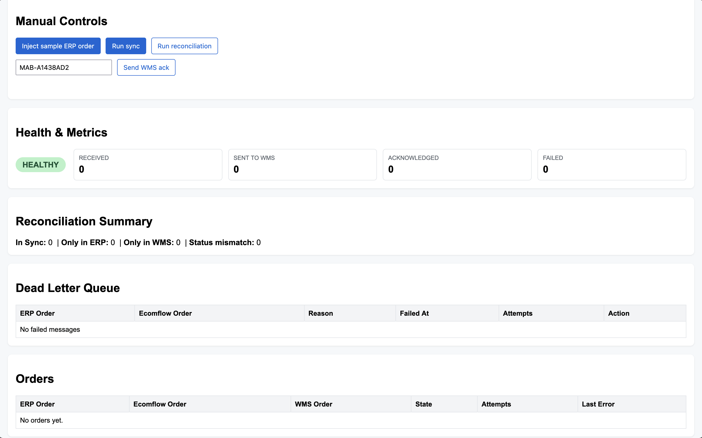

# Ecomflow Integration Case Study

Mini integration platform that simulates Fulfil (ERP) → Ecomflow → Mabang (WMS) order flow with reliability, monitoring, and a simple dashboard.

## Requirements

- Node.js 18+
- pnpm



## Getting Started

```bash
pnpm install
pnpm run dev
```

Server listens on `http://localhost:8787` and serves the dashboard.

## Key Endpoints

| Method | Path | Description |
| --- | --- | --- |
| POST | `/erp/orders` | Ingest Fulfil order (idempotent) |
| POST | `/sync/run` | Process pending orders, forward to WMS |
| POST | `/wms/ack` | Mock acknowledgment from WMS |
| GET | `/orders` | List all orders + states |
| GET | `/reconciliation/run` | Reconciliation summary/details |
| GET | `/health` | Health signal + metrics counters |
| GET | `/deadletters` | Dead letter queue overview |
| POST | `/deadletters/:erpOrderId/replay` | Replay a failed sync |
| POST | `/test/order` | Inject sample ERP order |

## Features

- Strict TypeScript + Zod validation
- In-memory database for ERP, sync, and WMS records
- Retry logic with capped attempts for WMS failures
- State machine: `PENDING_SYNC`, `SENT_TO_WMS`, `ACKNOWLEDGED_BY_WMS`, `FAILED`
- Dashboard surfacing orders, reconciliation summary, controls for injection, sync, and ack
- Health endpoint showing metrics + red/yellow status when mismatches grow
- Dead-letter queue UI with manual replay for permanently failed orders
- Mocked Mabang client with latency + random failures
